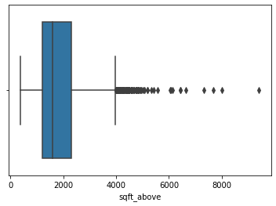

# Laporan Proyek Machine Learning - Evan Hanif Widiatama

## Domain Proyek

Rumah sebagai tempat tinggal adalah salah satu kebutuhan pokok manusia selain pakaian dan makanan. Setiap manusia membutuhkan rumah untuk tempat berlindung dan sebagai tempat berkumpul dan berlangsungnya aktivitas keluarga, sekaligus sebagai sarana investasi. Menentukan harga jual rumah bisa menjadi tugas yang sulit dan memerlukan beberapa pertimbangan. Beberapa fitur seperti luas rumah, luas tanah, kondisi rumah, letak rumah, dll dapat membuat bingung bagi pemilik rumah yang masih awam dan bingung untuk menjual rumahnya di harga tertentu.

Berlandaskan dari masalah ini, kita dapat menggatasinya dengan menggunakan algoritma machine learning. Supervised learning solusinya, kita dapat menggunakan dataset rumah berdasarkan fitur-fiturnya yang telah dilabeli dengan harga yang pantas untuk membuat model yang sesuai. Dengan ini, diharapkan masalah tentang kesulitan menentukan harga rumah dapat diatasi dengan model machine learning kita.

## Business Understanding

Sebagai tujuan awal, proyek ini dibangun untuk:
- Masyarakat umum yang sedang kebingungan untuk menentukan harga jual rumahnya
- Perusahaan jual-beli properti

### Problem Statements

1. Bagaimana cara memproses data agar dapat diterima oleh model?
2. Model apa yang paling baik untuk digunakan?

### Goals

1. Melakukan Data Preprocessing dengan tepat
2. Menggunakan MAE untuk mengetahui model yang paling baik.

### Solution statements

1. Melakukan Handling Outliers dengan IQR
2. Melakukan One Hot Encoding untuk categorical feature
3. Membuang fitur dengan korelasi kecil (|Correlation| <= 0.15)
4. Menggunakan Model Algoritma: KNN, AdaBoost, RandomForest, SVR

## Data Understanding
Dataset yang digunakan adalah dataset House Price Prediction yang didapatkan dari [Kaggle](https://www.kaggle.com/datasets/shree1992/housedata). Dataset ini memiliki 4600 sampel dengan 18 Fitur.

### Variabel-variabel pada dataset sebagai berikut:
- Price: Merepresentasikan harga dalam USD dan merupakan fitur target
- Bedroom: Merepresentasikan jumlah kamar tidur
- Bathroom: Merepresentasikan jumlah kamar mandi
- sqft_living: Merepresentasikan ukuran luas rumah
- sqft_lot: Merepresentasikan ukuran luas tanah
- waterfront: Merepresentasikan variabel dummmy apakah rumah berada dekat dengan akses perairan
- view: Merepresentasikan variabel dummy tentang view di sekitar rumah
- condition: Merepresentasikan kondisi rumah
- sqft_above: Merepresentasikan luas diatas tanah
- sqft_basement: Merepresentasikan luas basement
- yr_built: Merepresentasikan tahun kapan rumah dibuat
- yr_renovated: Merepresentasikan tahun kapan rumah terakhir direnovasi
- street: Merepresntasikan jalan letak rumah
- city: Merepresentasikan kota letak rumah

### EDA - Handling Outliers:
Berdasarkan visualisasi boxplot, terdapat beberapa outliers di fitur:  
  
  
  
  

untuk mengatasi itu, akan dilakukan penghapusan outliers dengan teknik IQR

### EDA - Univariate Analysis
- Categorical Feature: 
  
  

- Numerical Feature: 
  

### EDA - Multivariate Analyis
- Categorical Feature terhadap price: 
  
- Numerical Feature: 
  
- Correlation Matric: 
  

## Data Preparation
Pada data preparation, hal yang saya lakukan adalah:
1. One Hot Encoding untuk fitur kategorik
2. Reduksi dimensi dengan PCA, karena diketahui bahwa korelasi antara sqft_above dan sqft_living cukup tinggi, dan dapat dilihat dengan pairplot  

3. Train Test Split: karena dataset memiliki 4600 sampel, saya memutuskan untuk membaginya menjadi 80:20  

## Modeling
Pada saat modeling, saya menggunakan 4 algoritma: Support Vector Machine, K-Nearest Neighboor, Random Forest, AdaBoosting

### SVM  
SVM (Support Vector Machine) adalah salah satu jenis algoritma pembelajaran mesin yang digunakan untuk tugas klasifikasi dan regresi. SVM dapat digunakan untuk menemukan batas keputusan yang optimal untuk memisahkan dua kelas data dengan membangun sebuah hiperplane atau permukaan pemisah dengan jarak maksimum ke kelas-kelas data yang berbeda.  
Pada dasarnya, SVM mencoba untuk menemukan hiperplane terbaik yang membagi data ke dalam dua kelas sehingga jarak antara hiperplane dan setiap kelas data terdekat adalah maksimum. SVM juga dapat digunakan untuk memproyeksikan data ke dalam ruang dimensi yang lebih tinggi sehingga data yang tidak terpisahkan pada ruang dimensi rendah dapat dibagi secara efektif pada ruang dimensi yang lebih tinggi. SVM adalah algoritma yang sangat populer dan memiliki banyak aplikasi di berbagai bidang seperti pengolahan citra, analisis biomedis, klasifikasi teks, dan lain-lain.  

Kelebihan:  
1. SVM sangat efektif dalam menangani dataset dengan dimensi yang tinggi, terutama dalam kasus di mana jumlah fitur melebihi jumlah sampel.
2. SVM memberikan hasil yang sangat akurat dalam tugas klasifikasi, terutama ketika kelas data terpisah dengan baik.
3. SVM dapat digunakan dengan berbagai jenis kernel (seperti linear, polinomial, RBF, sigmoid) yang memungkinkan algoritma ini untuk menangani data yang kompleks atau non-linear.
4. SVM memiliki kemampuan untuk menghindari overfitting dengan menentukan batas keputusan yang optimal.
5. SVM dapat menangani data yang noise atau outlier.

Kekurangan:  
1. SVM membutuhkan waktu pelatihan yang lama, terutama pada dataset yang besar.
2. Pemilihan kernel yang tepat membutuhkan pengetahuan tentang dataset yang cukup.
3. SVM tidak cocok untuk data yang tidak seimbang atau tidak terpisah dengan baik.
4. SVM sulit untuk diinterpretasikan, sulit untuk mengetahui apa yang sedang dipelajari oleh algoritma.
5. SVM dapat menghasilkan hasil yang buruk jika parameter yang digunakan tidak disesuaikan dengan benar.

### KNN  
KNN atau K-Nearest Neighbors adalah sebuah algoritma dalam machine learning yang digunakan untuk klasifikasi atau regresi. Algoritma KNN bekerja dengan cara mencari K tetangga terdekat dari data yang ingin diprediksi, kemudian menentukan label atau nilai dari data tersebut berdasarkan mayoritas label atau nilai dari tetangga terdekat.  
Dalam konteks klasifikasi, KNN mencari K tetangga terdekat dari data yang ingin diklasifikasikan dan menentukan label yang paling sering muncul di antara tetangga tersebut sebagai label untuk data tersebut. Sedangkan dalam konteks regresi, KNN mencari K tetangga terdekat dari data yang ingin diprediksi dan menentukan nilai rata-rata dari nilai tetangga terdekat sebagai nilai prediksi untuk data tersebut.  
KNN membutuhkan pengukuran jarak antara setiap data yang ada dalam dataset, dan biasanya menggunakan Euclidean distance sebagai metrik jarak. KNN merupakan algoritma yang sederhana dan mudah dipahami, namun performanya dapat dipengaruhi oleh pemilihan nilai K dan metrik jarak yang digunakan.  

Kelebihan:  
1. Sederhana dan mudah dipahami: KNN termasuk algoritma yang mudah dimengerti karena hanya menghitung jarak antar data dan memilih label yang paling sering muncul pada tetangga terdekat.
2. Non-parametrik: KNN tidak memiliki asumsi tentang distribusi data dan tidak memerlukan estimasi parameter, sehingga dapat digunakan pada data non-linear.
3. Cocok untuk klasifikasi multi-kelas: KNN dapat dengan mudah diadaptasi untuk klasifikasi multi-kelas tanpa mengubah algoritma dasarnya.
4. Tidak memerlukan training: KNN tidak memerlukan waktu untuk training model karena hanya menyimpan data mentah dan label, sehingga dapat digunakan dengan cepat.

Kekurangan:  
1. Sensitif terhadap data noise: Karena KNN hanya mempertimbangkan jarak antara data, algoritma ini dapat sangat sensitif terhadap data noise atau pencilan (outlier).
2. Biaya komputasi yang tinggi: Menghitung jarak antara setiap data dengan data lain dalam dataset dapat memakan waktu dan biaya komputasi yang tinggi, terutama untuk dataset yang besar.
3. Pemilihan parameter yang krusial: Nilai K dan metrik jarak yang digunakan dapat mempengaruhi performa KNN secara signifikan, sehingga pemilihan parameter yang tepat sangat penting.
4. Tidak mengambil informasi struktur data: KNN hanya mempertimbangkan jarak antara data, sehingga tidak dapat menangkap struktur atau pola pada data yang kompleks.

### Random Forest  
Random forest adalah salah satu jenis algoritma pembelajaran mesin yang digunakan untuk tugas klasifikasi, regresi, dan pemrosesan data lainnya. Random forest menggunakan teknik ensemble learning yang menggabungkan beberapa pohon keputusan (decision tree) untuk membuat model prediksi yang lebih akurat.  
Random forest bekerja dengan membuat beberapa pohon keputusan secara acak, di mana setiap pohon dibangun dengan memilih sampel acak dari dataset training dan juga dengan memilih subset acak dari fitur-fitur yang tersedia. Kemudian, hasil dari setiap pohon dijumlahkan dan diambil rata-ratanya untuk menghasilkan prediksi akhir.  
Salah satu keuntungan dari random forest adalah kehandalannya dalam menangani masalah overfitting dan data yang noisy. Selain itu, random forest juga dapat menghasilkan fitur penting (feature importance) yang berguna dalam pemahaman terhadap data dan fitur-fiturnya. Random forest banyak digunakan dalam berbagai aplikasi seperti pengenalan citra, pengolahan bahasa alami, dan analisis keuangan.  

Kelebihan:
1. Akurasi yang Tinggi: Random Forest biasanya menghasilkan prediksi yang sangat akurat karena dapat menangani klasifikasi multi-kelas dan dataset yang berukuran besar.
2. Stabil pada Data yang Noisy: Algoritma ini stabil pada data yang noisy karena secara acak memilih sampel dan fitur dari dataset saat membangun setiap pohon keputusan.
3. Menghasilkan Fitur Penting: Random Forest dapat mengidentifikasi fitur-fitur penting dari dataset, sehingga membantu memahami bagaimana model melakukan prediksi dan memperbaikinya.
4. Scalable: Algoritma ini dapat memproses data yang besar dalam waktu yang singkat karena mampu membangun pohon keputusan secara paralel.

Kekurangan:
1. Kompleksitas: Random Forest cenderung lebih kompleks daripada algoritma pembelajaran mesin lainnya, sehingga membutuhkan waktu yang lebih lama untuk membangun model.
2. Tidak Transparan: Random Forest menghasilkan model yang sulit dipahami, sehingga sulit untuk menjelaskan bagaimana model melakukan prediksi.
3. Konsumsi Memori yang Tinggi: Algoritma ini membutuhkan memori yang cukup besar untuk memproses dataset yang berukuran besar, terutama jika jumlah pohon keputusan yang digunakan tinggi.
4. Rentan Terhadap Overfitting: Jika tidak dikelola dengan baik, Random Forest dapat rentan terhadap overfitting, terutama pada dataset yang kecil dan pohon keputusan yang terlalu dalam.

### AdaBoost  
Adaptive Boosting, juga dikenal sebagai "AdaBoost", adalah salah satu algoritma pembelajaran mesin yang populer untuk masalah klasifikasi dan regresi. Algoritma ini memperbarui bobot setiap sampel latihan secara iteratif, di mana sampel yang sulit diklasifikasikan diberi bobot lebih tinggi dan sampel yang mudah diklasifikasikan diberi bobot lebih rendah.  
Dalam setiap iterasi, algoritma menghasilkan model kecil yang mengambil sampel yang diberi bobot tinggi. Model ini kemudian digunakan untuk memprediksi label pada setiap sampel latihan. Kemudian, algoritma menghitung kesalahan prediksi dan memperbarui bobot sampel latihan berdasarkan kesalahan tersebut. Proses ini diulang beberapa kali, dan model-model kecil ini digabungkan untuk menghasilkan model akhir yang lebih kuat.  
Adaptive Boosting sangat efektif dalam mengatasi masalah overfitting dan bias, karena model-model kecil yang dihasilkan hanya memeriksa subset dari seluruh fitur, dan karena bobot diatur ulang pada setiap iterasi. Algoritma ini telah digunakan dalam berbagai aplikasi, termasuk pengenalan wajah, deteksi objek, dan klasifikasi teks.  

Kelebihan:
1. Akurasi yang tinggi: AdaBoost sering menghasilkan akurasi yang lebih tinggi daripada algoritma pembelajaran mesin lainnya.
2. Menangani data yang tidak seimbang: AdaBoost dapat menangani data yang tidak seimbang dengan baik karena sampel yang sulit diklasifikasikan diberi bobot yang lebih tinggi.
3. Mudah diimplementasikan: AdaBoost relatif mudah diimplementasikan dan dapat digunakan dengan berbagai jenis algoritma pembelajaran mesin.

Kekurangan:
1. Sensitif terhadap noise: AdaBoost rentan terhadap noise pada data latihan, yang dapat menyebabkan kesalahan pada model.
2. Lama waktu komputasi: Karena AdaBoost mengulangiterasi, waktu komputasi yang diperlukan untuk menghasilkan model yang baik dapat cukup lama.
3. Memerlukan data yang cukup: AdaBoost memerlukan setidaknya dua kelas data latihan yang berbeda dan jumlah sampel yang cukup besar untuk menghasilkan model yang baik.

## Evaluation
Untuk mengukur seberapa baik model, karena ini adalah masalah regresi, saya memutuskan untuk menggunakan metrik mean squared error

### Mean Squared Error (MSE)
Mean squared error (MSE) adalah salah satu ukuran kesalahan yang digunakan dalam statistik dan machine learning untuk mengevaluasi seberapa baik model regresi memprediksi nilai target. MSE menghitung rata-rata kuadrat perbedaan antara nilai prediksi dan nilai sebenarnya dari variabel target.  
Secara matematis, MSE dihitung dengan mengambil selisih antara nilai sebenarnya dan nilai prediksi, mengkuadratkannya, menjumlahkan hasilnya, dan kemudian membagi jumlah ini dengan jumlah sampel. Lebih formalnya, jika kita memiliki n sampel dengan nilai sebenarnya y_i dan nilai prediksi ŷ_i, maka MSE dapat dihitung sebagai berikut:  

Semakin kecil nilai MSE, semakin baik model regresi tersebut memprediksi nilai target. Namun, MSE tidak selalu cocok untuk digunakan dalam semua situasi, misalnya ketika terdapat banyak outlier dalam data.

Hasil dari MSE menunjukan:  
  
Dan dapat disimpulkan bahwa model terbaik adalah KNN
